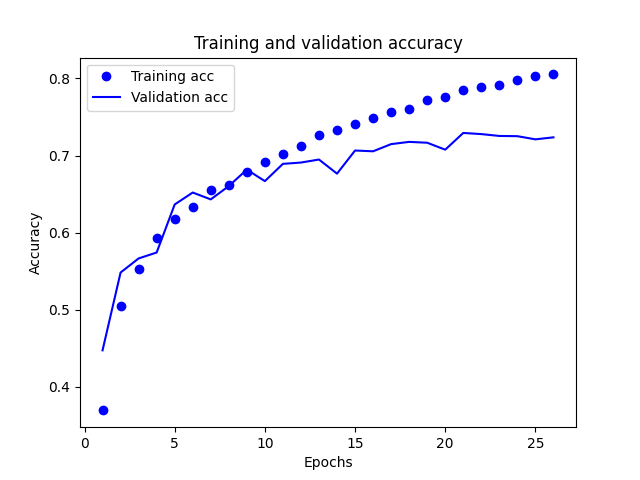
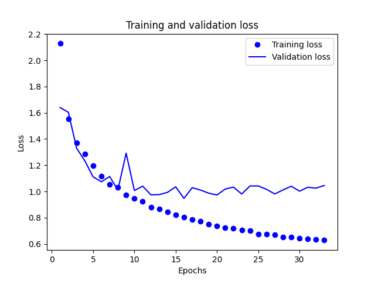

# CNN Image Classification

## Intro and Dataset

This project aims to create a Convolutional Neural Network (CNN) model capable of training on the CIFAR-10 dataset and classifying images based on the ten different classes available. The dataset was generated using natural images captured in 32x32 resolution with 6,000 images per class - the classes are airplanes, cars, birds, cats, deer, dogs, frogs, horses, ships, and trucks. Given the low resolution, uniform class distribution and relatively small size of the dataset, it is most commonly used to benchmark novel ideas in deep learning/computer vision that would otherwise be computationally expensive to train on large image datasets (e.g. imagenet).

## Purpose and Objectives

The purpose of this project is to demonstrate the implementation of a CNN model for image classification using CIFAR-10. By training the model on this dataset, we aim to achieve accurate and reliable classification results across a variety of low resolution images. Our goal is to understand how the implementation of various commonly used techniques leads to performance improvements in deep learning for computer vision applications:

- [x] [Trained a resnet](https://github.com/octocat/octoproject/issues/4)
- [ ] [Translate content into supported languages](https://github.com/octocat/octoproject/issues/11)

## Technologies Used

The following technologies were utilized in this project:

- Python: Programming language used for implementing the CNN model and associated scripts.
- TensorFlow: Deep learning framework used for building and training the CNN model.
- Keras: High-level neural networks API used as a frontend for TensorFlow, simplifying the model creation process.
- NumPy: Library used for efficient numerical computations and array operations.
- Matplotlib: Visualization library used for plotting and displaying images and performance metrics.
- Git: Version control system used for tracking changes and collaborating on the project.
- GitHub: Hosting platform for the project repository and collaboration with others.

## Dataset

The CIFAR-10 dataset can be downloaded from the following source:

- [CIFAR-10 Dataset](https://www.cs.toronto.edu/~kriz/cifar.html)

Please download the dataset and ensure it is available in the appropriate directory before running the model.

## Results

Here are some screenshots showcasing the results after training the model.


*Relationship bewtween the training and validation accuracy.*


*Relationship between the training and validation loss.*

## Instructions

To fork this repository and create your own copy on GitHub, follow these steps:

1. Visit the repository page on GitHub: [link to your repository](https://github.com/loisobrero/CNN-Image-Classification.git).

2. Click on the "Fork" button in the top-right corner of the page. This will create a copy of the repository under your own GitHub account.

3. Once the forking process is complete, you can clone the repository to your local machine using the following Git command:

   ```bash
   git clone https://github.com/loisobrero/CNN-Image-Classification.git


## License

This project is licensed under the MIT License - see the [LICENSE](LICENSE) file for details.
